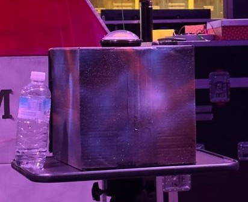
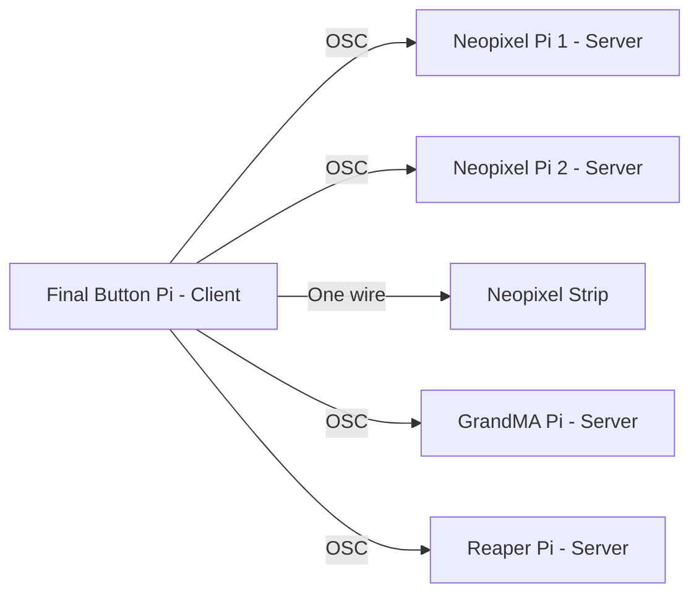
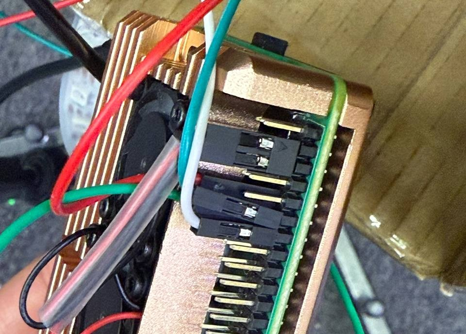
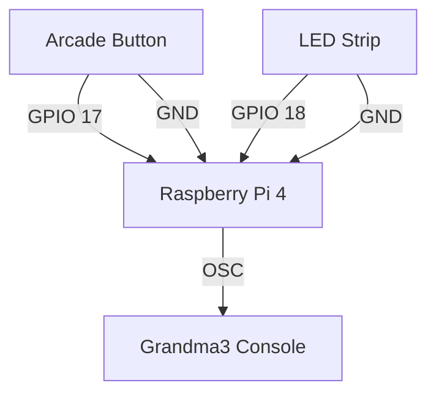

# 🏆 Final Sequence

As our Cadets face their final mission, Sector 536 also reaches the end of its journey. That is when 5 of our Agents from 4 teams present to you the Final Sequence. In this **Final Sequence**, you will witness a **Handmade Rocket** built entirely from cardboard, wrapped in glowing **NeoPixels**, brought to life with synchronized **lighting sequences** and **immersive audio**. *Captain Chromaflex* will have the honour to launch our **Handmade Rocket** to send us back to NYP. Here are the different elements that brought our **Final Sequence** to life.

- 🚀 [Hardware - Handmade Rocket](https://github.com/Nixx-Goh/EGL314-Project-Lumen-Team-D/blob/17852345f5a77e5acf652ab93767567bcbd8fb79/Final%20Sequence)
- 💡 [Neopixels](https://github.com/timsjt/EGL314_TEAMB/blob/main/Final%20Sequence-Neopixels/setup.md)
- ✨ [Lighting Sequences](https://github.com/YHLeong/EGL314_TeamC/tree/main/Final/Final%20lighting%20sequence/final%20lighting%20sequence.md)
- 🎶 [Immersive Audio + Button](https://github.com/Kean-en/TeamA-Egl314/tree/9e6a83c4c6c1ec6db7fd967705fbe311cad5f8f9/Code/Final%20Sequence/Final_button.md)

In this repository, we will be focusing on 🎶 **Immersive Audio + Button**.

---

<h2 id="diagram"> System Diagram</h2>

---

## Immersive Audio
### Software
1. Reaper
2. L-ISA Controller

### Hardware
1. Yamaha QL1
2. Speaker Amplifier

Refer to the [Audio Folder](https://github.com/Kean-en/TeamA-Egl314/tree/9e6a83c4c6c1ec6db7fd967705fbe311cad5f8f9/Code/MVP/Audio) for how to set up Reaper. Below will explain Open Sound Control (OSC) for **Immersive Audio** and other devices found in the <a href="diagram">Mermaid Diagram</a>.

## Final Button
This section will explain how the **Final Button** activates the ending sequence of the show.

### Software
1. GrandMA3 onPC 2.2.5.2
### Hardware
1. Push Button
2. Raspberry Pi 4
3. Neopixel WS2812B
4. Grandma3 Console
### System Diagram

The Arcade button is connected through **GPIO 17** and **GND**. The LED Strip is connected to **GPIO 18** and **GND**.

Refer to [Final.py](https://github.com/Kean-en/TeamA-Egl314/blob/eb700befac065672ebafc08e55b6f1789fc2cebd/Code/Final%20Sequence/Final.py) for the python script.