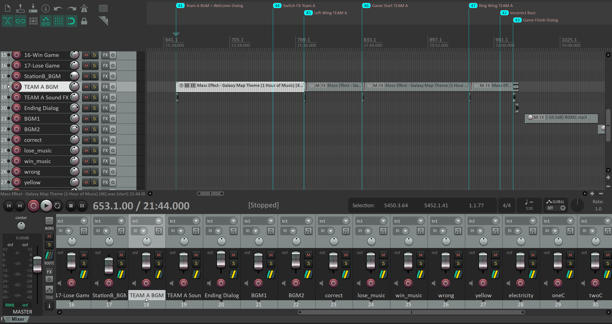
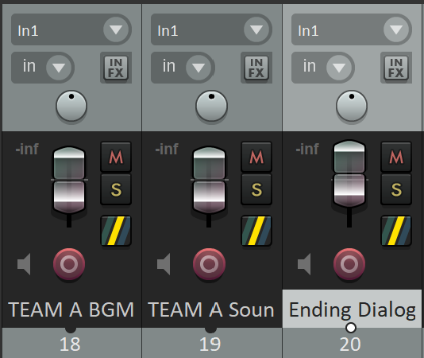
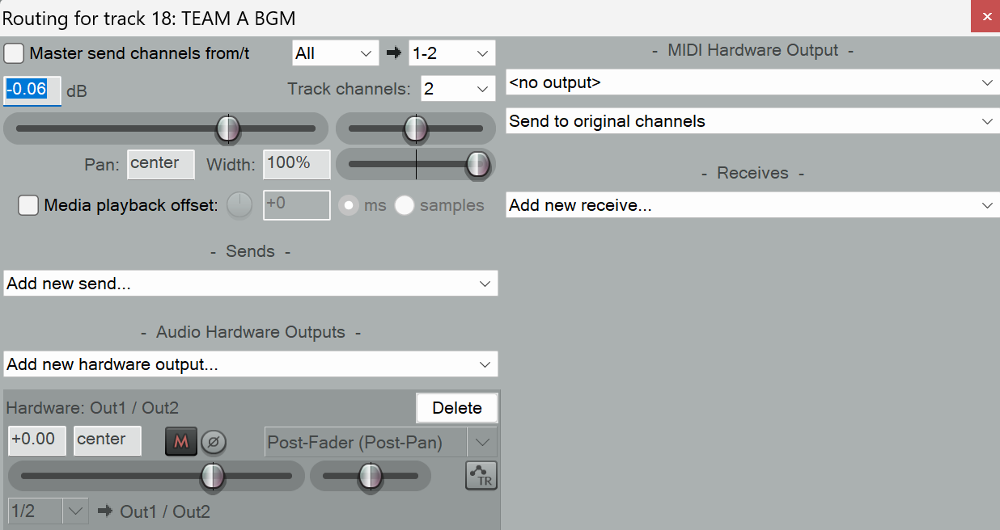
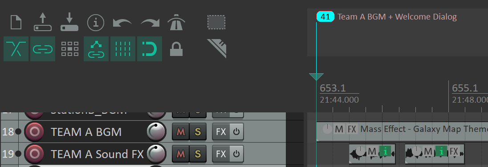
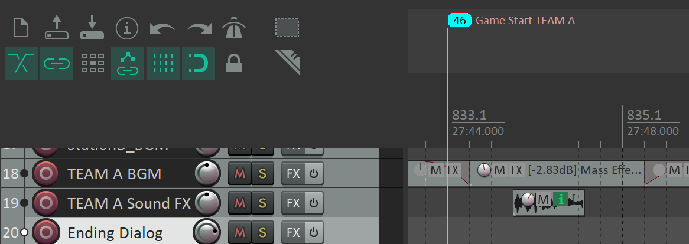
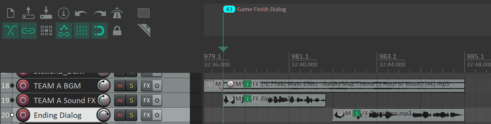
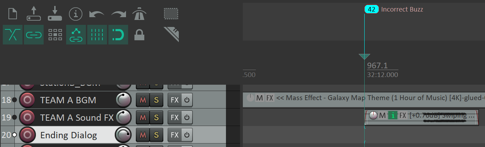
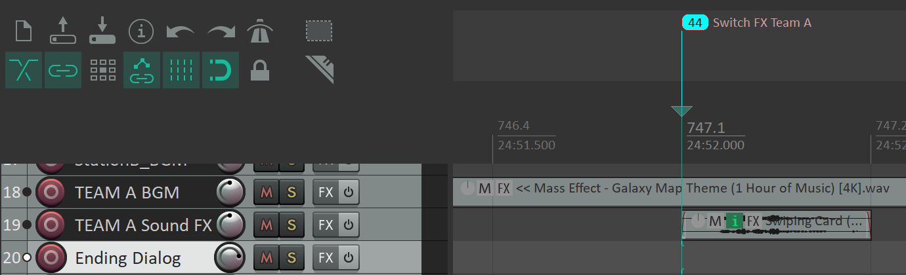
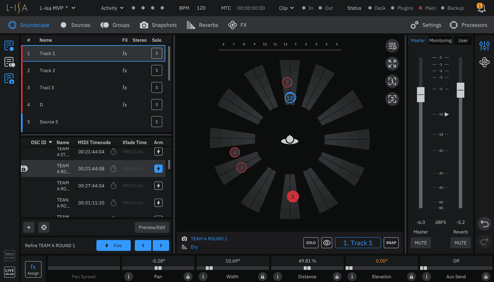
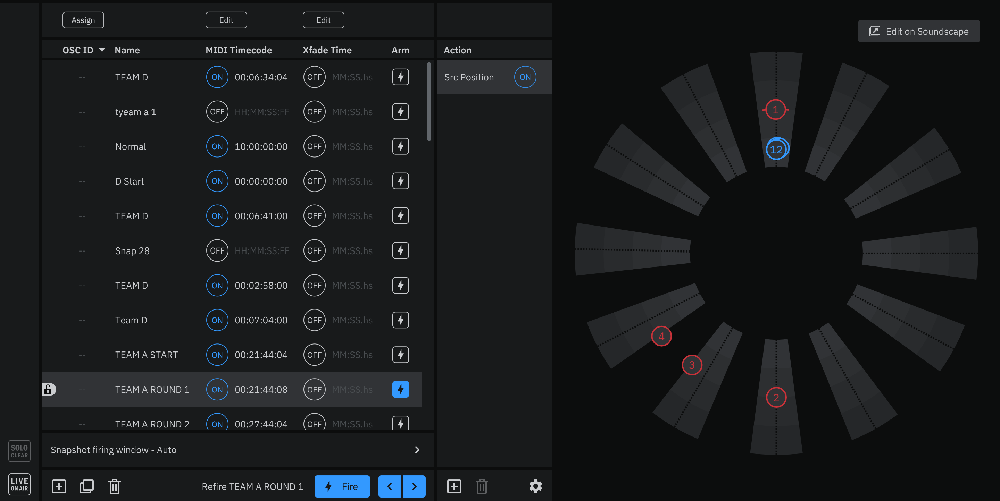

# Audio Logic

 

## Reaper
 
This is the audio tracks that we use for our game station, having a total of 7 markers, starting from numbers 41-47.

### Tracks
 
Team A uses 3 Audio tracks as there aren't many different audio inputs at a time that needs to be sent out of multiple different audio outputs. All tracks are set to 0dB on the gain fader as we edit the individual audio tracks volume to keep everything balanced.

#### BGM Track
 
This track just sends background music (BGM) to Outputs 1 and 2.

#### Sound FX & Dialog
 
This track mainly holds the various dialog and sound effects for our game, being sent out to only outputs 3 and 4.

#### Ending Dialog
 
This track is for the transitioning dialog from station 3 to 4, being sent out to outputs 1 and 2.

### Start (Marker 41)
 
The first marker is played when the station is activated, it will start the BGM and greet the guests as space cadets and welcoming them into the security station.

#### Hello
<audio src="Media/HelloSpaceCadets.mp3" controls></audio>

#### Welcome
<audio src="Media/Welcome.mp3" controls></audio>

### Game Start (Marker 46)
 
This marker is played when the Player versus Player (PvP) game starts and the players compete against each other, the BGM is lowered and faded in and out, the AI voice tells the players what to do.

#### Game Start
<audio src="Media/GameStart.mp3" controls></audio>

### Ending + Transition (Marker 43)
 
This marker is played when the game is over and a winner is decided, the music will come to an end and a player will be crowned Captain Chromaflex. There is also an audio track that Transitions into the next game station.

#### Captain Chromaflex
<audio src="Media/Finish.mp3" controls></audio>

#### Transition
<audio src="Media/Transition.mp3" controls></audio>

### Sound Effects

 
These markers are just for sound effects during the game, 42 is played when the player made a mistake and 44 is played whenever the player decides to press the green button to switch levels. These sound effects are cut out from an audio track.

#### Audio Track where Sound FX is cut
<audio src="Media/Swiping Card (Among Us Task OpenCloseComplete) - Sound Effect for editing.mp3" controls></audio>

____
## L-ISA
 
For the L-ISA, it is programmed so that Team A's BGM is dynamic across the whole room, and the dialog and sound effects pertaining to the game is within the audience's area.

### Snapshots
 
This is the snapshot that we use for the whole duration of the game, Sources 1 to 12 are connected to the reaper outputs correspondingly.

Source 1 and 2 has an FX that keeps them rotating around in a circle across the whole room at 2 points adjacent to each other, ensuring that the BGM is dynamic across the whole room.

Source 3 and 4 are slowly bouncing around the 7 to 8 o'clock position as there is where our game station is, allowing the dialog and sound effects to be heard by the audience.
