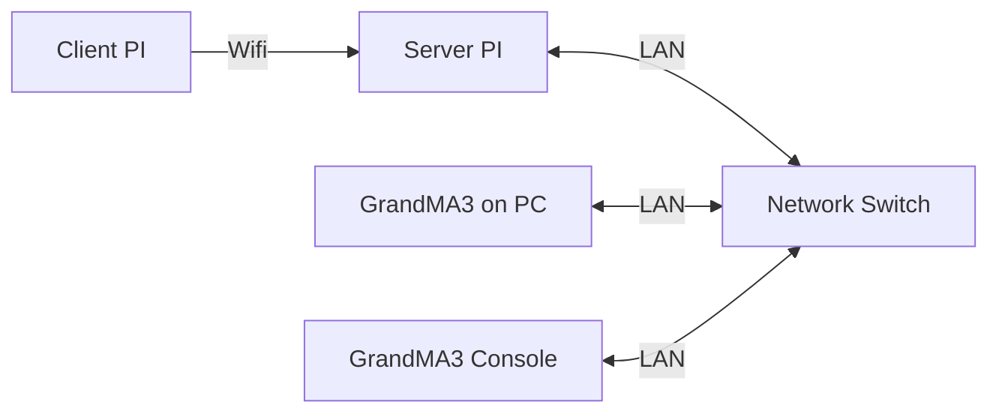

# GrandMa3 Lighting
## Introduction
This markdown will talk about how GrandMa3 is integrated into the game using OSC commands.

## System Diagram

### Configuration
---
This configuration is written in the main python script in order to configure the GrandMa3 OSC. The IP and Port below is the address configuration of the Server PI.
```
LIGHT_CLIENT = udp_client.SimpleUDPClient("192.168.254.213", 2000)
```
### OSC Commands
---
Below is an example of the message that is send to the Server PI from the Client PI.
```
LIGHT_CLIENT.send_message("/gma3/cmd", "Go+ Sequence 53")
```

### Logic FLow
---
The GrandMa3 accepts osc command from the server PI which then triggers either sequences or cue executors. This allows the lighting program to be controlled from the raspi allowing for a automated game.
