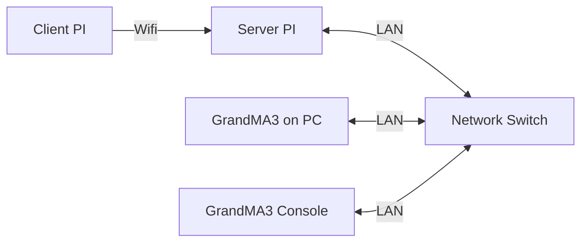

# GrandMa3 Lighting
## Introduction
This markdown will talk about how ***GrandMa3*** **(Lighting Software)** is integrated into the game using **Open Sound Control (OSC)** commands.

### Software
1. Grandma3 onPC 2.2.5.2

### Hardware
1. Raspberry Pi 4 (Client)
2. Raspberry Pi 4 (Server)
3. Grandma3 Console (Lighting Console)
4. Network Switch

## System Diagram

### Configuration
---

Refer to this [GitHub](https://github.com/huats-club/oscstarterkit/blob/c227154c0814446dd5f2b5bf73522bdb8801becc/tutorial5/tutorial5.md) to learn how to setup ***Grandma3*** for **OSC**

This configuration is written in the main python script in order to configure the *GrandMa3* **OSC**. The first line is the **python module** that is needed for **OSC**. The IP and Port below is the address configuration of the Server PI.
```
from pythonosc import udp_client

LIGHT_CLIENT = udp_client.SimpleUDPClient("192.168.254.213", 2000)
```


### OSC Commands
---
Below is an example of the message that is send to the Server PI from the Client PI.
```
LIGHT_CLIENT.send_message("/gma3/cmd", "Go+ Sequence 53")
```

### Logic FLow
---
The ***GrandMa3*** accepts **OSC** command from the *Server PI* which then triggers either sequences or cue executors. This allows the lighting program to be controlled from the raspi allowing for a automated game.
