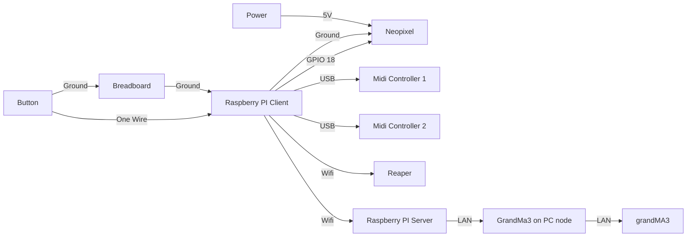

# Project L.U.M.E.N - Prism Cipher
## Introduction
Project L.U.M.E.N takes place in Sector 536 - A cosmic frontier within NYP , named after the classroom where it all began. This project is inspired by Singapore's growing investment in space research and technology. Sector 536 invites guests to explore a series of immersive space stationed at the edge of the unknown, these are the 4 exhibits :

Station 1 - Laser Defence Protocol
Station 2 - Kinetic Core Recharge
Station 3 - Chromatic Defence Simulator
Station 4 - Launch Core Override

  <h2 align = "center">
  Presented by:<br>
  <a href="https://github.com/syakiltrm"></a>
  <a href="https://github.com/Kean-en"></a>
  <a href="https://github.com/ArifYazid05"></a>
  <a href="https://github.com/Wayne-Teo"></a>
</h2>


## Dependencies
### Hardware:
1. Raspberry Pi 4
2. Neopixel WS2812B
3. 5V DC Supply
4. Midi Controller
5. Push Button
6. GrandMA3
7. Yamaha QL1

### Software
1. RealVNC 
2. Visual Studio Code
3. Raspbian OS
4. Reaper
5. L-ISA
### Python Packages:
1. GPIO 
2. rpi_ws281x
3. mido
4. osc
5. rtmidi
## System Diagram



# MVP Memory Game

A PVP memory-based coordination game designed for Raspberry Pi using:

- Raspberry Pi GPIO (physical button + NeoPixel control)
- Dual Launchpad Pro MK3 MIDI controllers
- WS2812b NeoPixel LED strip
- REAPER DAW for sound via OSC
- GrandMA3 lighting control via OSC

---

## Objective

Players must observe a flashing sequence of colors and replicate it using Launchpad blocks. The game gets progressively harder with longer sequences. The first player to complete the entire sequence wins the round.

---

## Project Structure

```
MVP/
└── Game Code/
    ├── run.py             # Main entry point to run the game code
    ├── lvl_1.py           # Level 1 logic (4-step sequence)
    ├── lvl_2.py           # Level 2 logic (8-step sequence)
    ├── lvl_3.py           # Level 3 logic (12-step sequence)
    └── Level_cycle.py     # Handles physical button and level selection
```

---

## Game Flow Overview

1. Hold the physical button for 2 seconds to start
2. Cycle through levels using the button, visually confirmed on Launchpad
3. Confirm level by pressing the green 2×2 confirmation pad block
4. NeoPixel displays the randomized color sequence
5. Players take turns replicating the pattern on their Launchpads
6. If a mistake is made, player restarts their turn
7. First to complete the sequence wins (Launchpad flashes green)

---

## How to Run the Game

### Hardware Required

- Raspberry Pi 3/4 with Raspberry Pi OS
- WS2812b NeoPixel LED strip (120 LEDs)
- 2 Launchpad Pro MK3 MIDI controllers (connected via USB to dedicated ports)
- 1 physical push button (connected to GPIO 17)
- REAPER (with OSC listerner enabled)
- GrandMA3 Lighting console (with OSC support)

### Software Requirements

Install these on your Raspberry Pi using pip:

```bash
pip install python-rtmidi
pip install python-osc
pip install rpi_ws281x
```

Enable SPI and PWM in Raspberry Pi settings for NeoPixel to work.

---

## Dependencies

- `mido`: For MIDI communication
- `python-rtmidi`: Back end for `mido`
- `rpi_ws281x`: Control NeoPixel LEDs
- `python-osc`: Send OSC messages to REAPER and GrandMA3
- `RPi.GPIO`: Control GPIO inputs (button)
- `threading`, `time`, `random`, `os`, `sys`: Standard libraries

---

## Launchpad Grid Mapping

The game uses an 8×8 grid on the Launchpad. Each cell corresponds to a MIDI note number based on the following logic:

```python
launchpad_grid = [[(r + 1) * 10 + (c + 1) for c in range(8)] for r in range(8)]
```

This generates the following layout:

```
81 82 83 84 85 86 87 88
71 72 73 74 75 76 77 78
61 62 63 64 65 66 67 68
51 52 53 54 55 56 57 58
41 42 43 44 45 46 47 48
31 32 33 34 35 36 37 38
21 22 23 24 25 26 27 28
11 12 13 14 15 16 17 18
```

Top-left starts at note 81, moving right adds 1, moving down subtracts 10 per row.

---

## Game Code Logic (Overview)

### NeoPixel Strip Control

- Strip has 120 LEDs
- Each color in a sequence gets an equal segment of LEDs
- Colors used: red, green, blue, yellow (RGB defined with `Color()`)

### Launchpad Logic

- Each colored block is a 2x2 square of Launchpad pads
- 16 blocks generated for each level (non-overlapping)
- Sequence steps increase per level:
  - Level 1: 4
  - Level 2: 8
  - Level 3: 12

### Player Input Logic

- Presses are matched against expected sequence color
- Wrong press → Launchpad turns red briefly, sequence restarts
- Right press → Block turns off, progresses to next step
- First player to complete sequence wins

---

## Level Selection Logic

Implemented in `Level_cycle.py`:

- A physical button on GPIO 17 is used to cycle levels (0 to 2)
- Visual shapes on Launchpad show current level
- Green 2x2 confirmation block (top-right corner) confirms selection
- After confirmation, game proceeds via `run.py` to the correct level

---

## OSC Integration

- Sends `/marker/26` and `/marker/30` to REAPER to trigger sounds
- Sends `Go+ Sequence` and `Off thru Sequence` to GrandMA3 to control lights

---

## Running the Game

To run the game, execute:

```bash
sudo python3 run.py
```

Make sure all hardware is connected, and REAPER + GrandMA3 are running and listening for OSC commands.

---

## Notes

- Code assumes specific MIDI port names for Launchpad MK3:
  - MIDI 28:0 and 32:0
- If different, use `mido.get_input_names()` to list your device names

---

## Level Script Breakdown

Each level is implemented in its own script file with an upscale of difficulty and sequence length. The structure and logic remain consistent, but with increased complexity:

---

### `lvl_1.py` – Level 1: Basic (4 Steps)

#### Sequence

* 4 steps in the memory sequence
* Colors are chosen randomly from: red, green, blue, yellow

#### Gameplay Flow

* 2 players
* Launchpad displays 2×2 color blocks in random positions
* NeoPixel strip shows full color sequence
* Players take turns to match the sequence

#### Win Condition

* First player to press the correct 4-block sequence wins

---

### `lvl_2.py` – Level 2: Intermediate (8 Steps)

#### Sequence

* 8 steps in the memory sequence
* Same color choices, longer sequence
* Players must press the pad double the length of Level 1

#### Reset Logic

* If a wrong press is made:

  * Launchpad flashes red
  * Audio marker 30 is triggered in REAPER
  * Player must restart from the beginning of the sequence

---

### `lvl_3.py` – Level 3: Expert (12 Steps)

#### Sequence

* 12 steps in the memory sequence
* Most challenging level

#### Memory Challenge

* Higher cognitive demand
* Randomized sequence and pad layout each run

#### Same Visual/Auditory Feedback

* OSC marker 26 signals game start
* Sequence displayed via NeoPixel
* GrandMA3 lights cue Sequence 55 and 54

---

### `Level_cycle.py` – Level Selector

#### Function

* Allows players to select the level (1 to 3) before starting

#### Inputs

* **Push button** (GPIO 17): Cycles between levels 0–2
* **Launchpad 2×2 green block**: Confirms selected level

#### Visuals

* Launchpad highlights different shape per level (blue)
* Top-right block glows green for confirmation
* NeoPixel strip shows random solid color for feedback

#### OSC Control

* Sends `/gma3/cmd` for light cue Sequence 52 during level select
* Sends `/marker/26` to REAPER when button is pressed (debounced)

#### Logic Flow

1. Cycle through levels using push button
2. Select level using green confirmation block
3. Clears Launchpad visuals
4. Returns selected level (1–3) to `run.py`

---

### Common Features Across All Levels

| Feature              | Description                                                                 |
| -------------------- | --------------------------------------------------------------------------- |
| NeoPixel Display     | Color sequence shown at start across 120 LEDs                               |
| 2-Player Competition | Both players get independent MIDI input/output                              |
| Block Drawing Logic  | Launchpad divided into randomized 2×2 blocks                                |
| Sequence Matching    | Players must press blocks in correct order based on LED + Launchpad display |
| Wrong Input Handling | Flash red, reset player, send OSC marker `/marker/30` to REAPER             |
| Win Logic            | First to complete sequence triggers flashing green and ends the round       |


