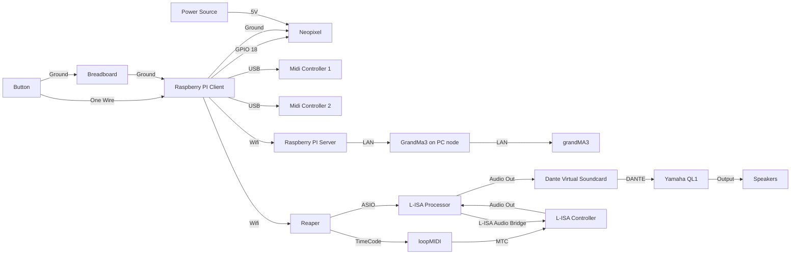

# Project L.U.M.E.N - Prism Cipher
## Introduction
Project L.U.M.E.N takes place in Sector 536 - A cosmic frontier within NYP , named after the classroom where it all began. This project is inspired by Singapore's growing investment in space research and technology. Sector 536 invites guests to explore a series of immersive space stationed at the edge of the unknown, these are the 4 exhibits :

Station 1 - Laser Defence Protocol
Station 2 - Kinetic Core Recharge
Station 3 - Chromatic Defence Simulator
Station 4 - Launch Core Override

  <h2 align = "center">
  Presented by:<br>
  <a href="https://github.com/syakiltrm"></a>
  <a href="https://github.com/Kean-en"></a>
  <a href="https://github.com/ArifYazid05"></a>
  <a href="https://github.com/Wayne-Teo"></a>
</h2>

## How does our game work? **Station 3**
1. Cadet holds the button for 2 seconds to start the game (Neopixel light for indication).
2. Cadet gets to choose between 3 levels by pressing the button cycling through the levels.
3. Cadet presses the 2x2 green box on the midi pad to confirm and play the selected level.
4. After selected level has been chosen, a sequence of colours (green, yellow, blue and red) will be shown on the neopixel strip
5. On the midi pad, multiple 2x2 colours (green, yellow, blue and red) will also be shown
6. Cadets must press identical colours on the midi pad following the sequence shown on the neopixel strip starting from right to left.
7. AFter Cadet is done playing, they have the option of holding the button for 3 seconds to shut down the game. 


## Dependencies
### Hardware:
1. Raspberry Pi 4
2. Neopixel WS2812B
3. 5V DC Supply
4. Midi Controller
5. Latch Button
6. GrandMA3
7. Yamaha QL1

### Software
1. RealVNC 
2. Visual Studio Code
3. Raspbian OS
4. Reaper - Version 7.39
5. L-ISA Processor - Version 3.2.2.5865
6. L-ISA controller - Version 3.2.2.12429
### Python Packages:
1. GPIO 
2. rpi_ws281x
3. mido
4. osc
5. rtmidi
## System Diagram




# MVP Code Logic

## run.py
1. `time` -> small delays and timing the button hold
2. `mido` -> MIDI I/O to talk to both Launchpad Pro MK3s
3. `RPI.GPIO as GPIO` -> read the physical push button.
4. `Adafruit_NeoPixel, Color` -> drive the WS2812B LED Strip
5. `SimpleUDPClient` -> send OSC messages to Reaper and GrandMA3
6. `lvl_1, lvl_2, lvl_3, Level_cycle` -> your game modules (gameplay + level select)
### `GPIO Button Setup`
```python
BUTTON_PIN = 17
GPIO.setmode(GPIO.BCM)
GPIO.setup(BUTTON_PIN, GPIO.IN, pull_up_down=GPIO.PUD_UP)
```
- Uses the number inside the chip (GPIO 17)
- Button is configured as an input with pull-up
- Read HIGH when idle and LOW when pressed

### `OSC CLients`
```python
REAPER_CLIENT = SimpleUDPClient("192.168.254.12", 8000)
LIGHT_CLIENT  = SimpleUDPClient("192.168.254.213", 2000)
```
- Reaper receives /marker and /action 1007(play)
- GrandMA3 receives /gma3/cmd commands

### `NeoPixel Setup`
```python
LED_COUNT = 120
LED_PIN   = 18
strip = Adafruit_NeoPixel(LED_COUNT, LED_PIN)
strip.begin()
```
- 120 LEDS on GPIO 18
- strip.begin() initializes the LED driver
### `MIDI Setup` (two launchpads)
```python
inport1 = mido.open_input("... MIDI 20:0")
outport1 = mido.open_output("... MIDI 20:0")

inport2 = mido.open_input("... MIDI 24:0")
outport2 = mido.open_output("... MIDI 24:0")
```
- Opens Player 1 on port 20:0 and Player 2 on 24:0
- Only read from these in level scripts
- Use outputs to clear pads

### `send_marker(n)`
```python
def send_marker(n: int):
    REAPER_CLIENT.send_message("/marker", n)
    REAPER_CLIENT.send_message("/action", 1007)  # ▶ Play
```
- Jumps to marker n in REAPER and immediately plays
- Used in main() for marker 25 (start dialog)

### `clear_launchpads()`
```python
def clear_launchpads():
    for note in range(128):
        outport1.send(mido.Message('note_off', note=note, velocity=0))
        outport2.send(mido.Message('note_off', note=note, velocity=0))
```
- Sends note_off to all 128 notes on both Launchpads
- Ensures both grids are fully dark/clean between states

### `strip_color_off()`
```python
def strip_color_off():
    for i in range(strip.numPixels()):
        strip.setPixelColor(i, Color(0, 0, 0))
    strip.show()
```
- Turns every LED off and updates the strip

  ### `Button Hold` 
  ```python
  def wait_for_2s_hold():
    print("Hold the button for 2 seconds to start the game...")
    hold_start = None
    progress_steps = LED_COUNT
    while True:
        if GPIO.input(BUTTON_PIN) == GPIO.LOW:
            if hold_start is None:
                hold_start = time.time()
            held_time = time.time() - hold_start
            progress = min(int((held_time / 2.0) * progress_steps), LED_COUNT)

            # Green progress bar
            for i in range(LED_COUNT):
                strip.setPixelColor(i, Color(0, 255, 0) if i < progress else Color(0, 0, 0))
            strip.show()

            # Reached 2 seconds → start
            if held_time >= 2.0:
                print("[HOLD] 2-second hold detected. Game starting.")
                print("[OSC] LIGHT: Go+ Sequence 56")
                LIGHT_CLIENT.send_message("/gma3/cmd", "Go+ Sequence 56")
                strip_color_off()
                return
        else:
            # Released early → reset progress bar
            hold_start = None
            strip_color_off()
        time.sleep(0.01)
- Waits until the button is held for 2 seconds continuously
- Shows a green progress bar across the strip as feedback
- Triggers GrandMA3 cue (Go+ Sequence 56)
- Clears the strip and returns to continue program


### `main()` Function

```python
def main():
    wait_for_2s_hold()
    send_marker(25)  # 🎙️ Start dialog marker (with playback)

    while True:
        level = Level_cycle.select_level()  # level select UX + markers (26/28) inside
        clear_launchpads()

        if level == 1:
            REAPER_CLIENT.send_message("/level_start", 1)
            lvl_1.run_level_1(REAPER_CLIENT, LIGHT_CLIENT, strip)
        elif level == 2:
            REAPER_CLIENT.send_message("/level_start", 2)
            lvl_2.run_level_2(REAPER_CLIENT, LIGHT_CLIENT, strip)
        elif level == 3:
            REAPER_CLIENT.send_message("/level_start", 3)
            lvl_3.run_level_3(REAPER_CLIENT, LIGHT_CLIENT, strip)

        clear_launchpads()
        strip_color_off()
        time.sleep(1)
```
- Requires the 2-second button hold.
- Audio start: send_marker(25) to REAPER and auto-play
- Level selection: calls Level_cycle.select_level()
- Run selected level
- Cleanup after level ends

### `Program entry and safe exit`
```python
if __name__ == "__main__":
    try:
        main()
    except KeyboardInterrupt:
        print("\n[EXIT] Game interrupted by user.")
        clear_launchpads()
        strip_color_off()
        GPIO.cleanup()
        exit(0)
```
- Running python3 run.py executes main()
- When pressed CTRL+C, cleans up launchpads, LEDs and GPIO state then exits cleanly


## Level_cycle.py

### `imports`
```python
import RPi.GPIO as GPIO
import time
import threading
import mido
import random
from rpi_ws281x import Color, Adafruit_NeoPixel
from pythonosc import udp_client

BUTTON_PIN = 17

# OSC
REAPER_CLIENT = udp_client.SimpleUDPClient("192.168.254.12", 8000)
LIGHT_CLIENT  = udp_client.SimpleUDPClient("192.168.254.213", 2000)

# MIDI (Launchpad used for selection UI)
MIDI_PORT = "Launchpad Pro MK3:Launchpad Pro MK3 LPProMK3 MIDI 24:0"
inport  = mido.open_input(MIDI_PORT)
outport = mido.open_output(MIDI_PORT)

# NeoPixel
LED_COUNT = 120
LED_PIN   = 18
strip = Adafruit_NeoPixel(LED_COUNT, LED_PIN)
strip.begin()

# GPIO button
GPIO.setmode(GPIO.BCM)
GPIO.setup(BUTTON_PIN, GPIO.IN, pull_up_down=GPIO.PUD_UP)
```
- Initializes OSC, MIDI for one launchpad (selection level), NeoPixel (120 LEDs on GPIO 18), and a GPIO 17 button

### `Launchpad grid and visuals`
```python
launchpad_grid = [[(r + 1) * 10 + (c + 1) for c in range(8)] for r in range(8)]

LEVEL_SHAPES = {
    0: [launchpad_grid[0][4], launchpad_grid[1][4], launchpad_grid[2][4], launchpad_grid[3][4], launchpad_grid[4][4]],
    1: [launchpad_grid[0][3], launchpad_grid[0][4], launchpad_grid[0][5],
        launchpad_grid[1][3],
        launchpad_grid[2][3], launchpad_grid[2][4], launchpad_grid[2][5],
        launchpad_grid[3][5],
        launchpad_grid[4][3], launchpad_grid[4][4], launchpad_grid[4][5]],
    2: [launchpad_grid[0][3], launchpad_grid[0][4], launchpad_grid[0][5],
        launchpad_grid[1][5],
        launchpad_grid[2][3], launchpad_grid[2][4], launchpad_grid[2][5],
        launchpad_grid[3][5],
        launchpad_grid[4][3], launchpad_grid[4][4], launchpad_grid[4][5]]
}

# Confirm block (bottom-right 2×2)
CONFIRM_BLOCK = [launchpad_grid[y][x] for y in range(6, 8) for x in range(6, 8)]

COLOR_OFF   = 0
COLOR_GREEN = 21
COLOR_BLUE  = 73
```
- `launchpad_grid`: 8x8 pad notes
- `LEVEL_SHAPES`: blue pad patterns for Level 1/2/3
- `CONFIRM_BLOCK`: green 2x2 block at bottom-right, press to confirm level

### `Button event and state`
```python
button_event = threading.Event()
level_index  = 0

def button_callback(channel):
    button_event.set()

GPIO.add_event_detect(BUTTON_PIN, GPIO.FALLING, callback=button_callback, bouncetime=300)
```
- Hardware interrupt sets button_event on a short press (with debounce)

### `OSC/LED/LP`
```python
def send_marker(n: int):
    REAPER_CLIENT.send_message("/marker", n)
    REAPER_CLIENT.send_message("/action", 1007)

def show_solid_color(color):
    for i in range(strip.numPixels()):
        strip.setPixelColor(i, color)
    strip.show()

def get_random_color():
    colors = [Color(255, 0, 0), Color(0, 255, 0), Color(0, 0, 255),
              Color(255, 255, 0), Color(255, 0, 255), Color(0, 255, 255)]
    return random.choice(colors)

def run_pixel_wipe():
    width = 5
    delay = 0.01
    n = strip.numPixels()

    for head in range(n + width):
        for j in range(n):
            strip.setPixelColor(j, Color(0, 0, 0))
        for k in range(width):
            idx = head - k
            if 0 <= idx < n:
                strip.setPixelColor(idx, Color(255, 255, 255))
        strip.show()
        time.sleep(delay)

    for i in range(n):
        strip.setPixelColor(i, Color(0, 0, 0))
    strip.show()

def clear_launchpad():
    for note in range(0, 128):
        outport.send(mido.Message('note_on', note=note, velocity=COLOR_OFF))

def draw_level_selection(index):
    clear_launchpad()
    for note in LEVEL_SHAPES[index]:
        outport.send(mido.Message('note_on', note=note, velocity=COLOR_BLUE))
    for note in CONFIRM_BLOCK:
        outport.send(mido.Message('note_on', note=note, velocity=COLOR_GREEN))
```
- `send_marker` -> REAPER/marker n then /action 1007 (play)
- `show_solid_color` and `get_random_color` -> strip feedback
- `run_pixel_wipe` -> white wipe animation
- `clear_launchpad` and `draw_level_selection` -> paint the current level shape (blue) + confirm block (green)

### `pre-roll`
```python
def select_level():
    global level_index
    cooldown_until = time.time() + 3
    hold_start = None

    # Lighting pre-roll
    LIGHT_CLIENT.send_message("/gma3/cmd", "Off Sequence thru Please")
    LIGHT_CLIENT.send_message("/gma3/cmd", "Go+ Sequence 52")
    time.sleep(1)
    LIGHT_CLIENT.send_message("/gma3/cmd", "Go+ Sequence 53")

    # Drain stale MIDI
    try:
        while True:
            msg = inport.receive(block=False)
            if msg is None:
                break
    except Exception:
        pass

    # Ensure button released
    while GPIO.input(BUTTON_PIN) == GPIO.LOW:
        time.sleep(0.01)

    draw_level_selection(level_index)
    show_solid_color(get_random_color())
```
- Runs GrandMA3 pre-roll cues, flushes any stale MIDI, ensures button isnt currently held, then shows current level(blue shape+ green confirm) and fills strip with a random color

### `short press`
```python
    SHUTDOWN_HOLD_SECS = 3.0

    while True:
        # short press → cycle
        if button_event.is_set():
            if time.time() < cooldown_until:
                button_event.clear()
                continue

            button_event.clear()
            level_index = (level_index + 1) % 3
            draw_level_selection(level_index)

            show_solid_color(get_random_color())
            send_marker(26)  # REAPER: "level select cycle"

            time.sleep(0.3)
            for i in range(strip.numPixels()):
                strip.setPixelColor(i, Color(0, 0, 0))
            strip.show()

            run_pixel_wipe()
```
- Short press cycles levels 1,2 and 3
- Updates the Launchpad UI, changes strip color
- Sends /marker 26 to REAPER, and plays wipe animation

### `Confirmed pad`
```python
        # confirm on green 2×2
        msg = inport.receive(block=False)
        if msg and msg.type == 'note_on' and msg.velocity > 0:
            if msg.note in CONFIRM_BLOCK:
                clear_launchpad()
                send_marker(28)  # REAPER: "level confirmed"
                while GPIO.input(BUTTON_PIN) == GPIO.LOW:
                    time.sleep(0.01)
                time.sleep(0.5)
                return level_index + 1
```
- Press any pad in the green confirmed block to lock the level
- REAPER /marker 28, clear the LP, return 123.

### `Hold to shutdown`
```python
        # hold to shutdown (3s)
        if GPIO.input(BUTTON_PIN) == GPIO.LOW:
            if hold_start is None:
                hold_start = time.time()

            held_time = time.time() - hold_start
            progress = min(int((held_time / SHUTDOWN_HOLD_SECS) * LED_COUNT), LED_COUNT)

            for i in range(LED_COUNT):
                strip.setPixelColor(i, Color(255, 0, 0) if i < progress else Color(0, 0, 0))
            strip.show()

            if held_time >= SHUTDOWN_HOLD_SECS:
                send_marker(31)  # REAPER: "shutdown"
                for i in range(strip.numPixels()):
                    strip.setPixelColor(i, Color(0, 0, 0))
                strip.show()
                clear_launchpad()
                time.sleep(1)
                exit(0)
        else:
            hold_start = None
            for i in range(strip.numPixels()):
                strip.setPixelColor(i, Color(0, 0, 0))
            strip.show()

        time.sleep(0.01)
```
- Holding the physical button, shows a red progress bar on the strip
- At 3s, sends REAPER /marker 31, clears visuals, and exits

## Merged Gameplay logic, lvl_1,2 and 3

### `Imports`
```python
import RPi.GPIO as GPIO
import time
import random
import mido
import sys
from rpi_ws281x import Color

NEO_COLORS = {
    'red': Color(255, 0, 0), 'green': Color(0, 255, 0),
    'blue': Color(0, 0, 255), 'yellow': Color(255, 255, 0)
}

COLOR_MAP = {
    'red': 5, 'green': 21, 'blue': 78, 'yellow': 13,
    'cyan': 3, 'orange': 37, 'magenta': 54, 'yellowgreen': 91,
    'white': 122, 'brown': 127, 'off': 0
}

inport1  = mido.open_input("Launchpad Pro MK3:Launchpad Pro MK3 LPProMK3 MIDI 20:0")
outport1 = mido.open_output("Launchpad Pro MK3:Launchpad Pro MK3 LPProMK3 MIDI 20:0")
inport2  = mido.open_input("Launchpad Pro MK3:Launchpad Pro MK3 LPProMK3 MIDI 24:0")
outport2 = mido.open_output("Launchpad Pro MK3:Launchpad Pro MK3 LPProMK3 MIDI 24:0")

launchpad_grid = [[81 - 10 * r + c for c in range(8)] for r in range(8)]
```
- Color maps for NeoPixel and Launchpad
- Opens two Launchpads (P1 on 20:0, P2 on 24:0)
- `launchpad_grid` computes the MK3 note numbers for each pad

### `Strip/board`
```python
def clear_pixels(strip):
    for i in range(strip.numPixels()):
        strip.setPixelColor(i, Color(0, 0, 0))
    strip.show()

def clear_board(outport):
    for row in launchpad_grid:
        for n in row:
            outport.send(mido.Message('note_on', note=n, velocity=0))

def show_sequence_on_strip(strip, sequence):
    num_colors = len(sequence)
    pixels_per = strip.numPixels() // num_colors
    idx = 0
    for color in sequence:
        c = NEO_COLORS[color]
        for _ in range(pixels_per):
            if idx < strip.numPixels():
                strip.setPixelColor(idx, c)
                idx += 1
    while idx < strip.numPixels():
        strip.setPixelColor(idx, Color(0, 0, 0))
        idx += 1
    strip.show()
```
- Clear the strip and Launchpads
- Display the sequence by segmenting the strip evenly per color step

### `Sequence and block`
```python
def get_unique_sequence(length):
    base = ['red', 'green', 'blue', 'yellow']
    pool = [random.choice(base) for _ in range(length)]
    while any(pool[i] == pool[i + 1] for i in range(len(pool) - 1)):
        pool = [random.choice(base) for _ in range(length)]
    return pool

def get_2x2_block(x, y):
    return [launchpad_grid[y + dy][x + dx] for dy in range(2) for dx in range(2)]

def light_block(outport, block, color):
    vel = COLOR_MAP[color]
    for n in block:
        outport.send(mido.Message('note_on', note=n, velocity=vel))

def flush_midi_input(inport):
    while inport.poll():
        pass

def setup_blocks():
    all_positions = [(x, y) for x in range(0, 7, 2) for y in range(0, 7, 2)]
    random.shuffle(all_positions)
    return [get_2x2_block(x, y) for x, y in all_positions]

def draw_blocks(player, sequence):
    player['note_map'].clear()
    for i in range(player['index'], len(sequence)):
        blk = player['blocks'][i]
        color = sequence[i]
        light_block(player['outport'], blk, color)
        for n in blk:
            player['note_map'][n] = (blk, color)

def restart_sequence(player, sequence):
    player['index'] = 0
    clear_board(player['outport'])
    draw_blocks(player, sequence)
```
- `get_unique_sequence` avoids adjacent duplicates
- Blocks are 2x2 regions; `setup_blocks()` gives a shuffled, non-overlapping layout.
- `draw_blocks` lights up the grid and builds note mappings
- `restart_sequence` resets the progress for a player

### `winner flash`
```python
def flash_winner(winner):
    for _ in range(3):
        for row in launchpad_grid:
            for n in row:
                outport1.send(mido.Message('note_on', note=n, velocity=COLOR_MAP['green' if winner == 1 else 'red']))
                outport2.send(mido.Message('note_on', note=n, velocity=COLOR_MAP['green' if winner == 2 else 'red']))
        time.sleep(0.2)
        clear_board(outport1)
        clear_board(outport2)
        time.sleep(0.1)
```
- Flashes both Launchpads 3 times: P1=green, P2=red

### `Level start cues`
```python
def run_level_1(reaper_client, light_client, strip):
    try:
        # REAPER: level start mark (per your file uses /marker/26 once)
        reaper_client.send_message("/marker/26", 1.0)

        # grandMA3 cues
        light_client.send_message("/gma3/cmd", "Off Sequence thru Please")
        light_client.send_message("/gma3/cmd", "Go+ Sequence 55")
        time.sleep(2)
        light_client.send_message("/gma3/cmd", "Off Sequence thru Please")
        light_client.send_message("/gma3/cmd", "Go+ Sequence 54")
```
- Sends a REAPER cue (/marker/26) and lighting cues

### `Build and show sequence`
```python
        seq_len  = 4  # lvl_2: 8, lvl_3: 12
        sequence = get_unique_sequence(seq_len)
        show_sequence_on_strip(strip, sequence)

        clear_board(outport1)
        clear_board(outport2)
```
- Lvl 1 uses 4 steps, Lvl 2 -> 8, Lvl3 -> 12
- Strip shows the full sequence as color segments
- Clears both Launchpads to prep for gameplay

### `Preparation`
```python
        last_press_time = [0, 0]
        debounce_threshold = 0.25

        flush_midi_input(inport1)
        flush_midi_input(inport2)
        time.sleep(0.5)

        player_data = [
            {'inport': inport1, 'outport': outport1, 'state': 'PLAY', 'red_end': 0,
             'index': 0, 'note_map': {}, 'blocks': setup_blocks()},
            {'inport': inport2, 'outport': outport2, 'state': 'PLAY', 'red_end': 0,
             'index': 0, 'note_map': {}, 'blocks': setup_blocks()}
        ]

        for p in player_data:
            draw_blocks(p, sequence)

        flush_midi_input(inport1)
        flush_midi_input(inport2)

        winner_found = False
```
- Sets a debounce, flushes inputs, builds per-player state dicts, draws all step blocks, starts with no winner

### `Correct press`
```python
        while not winner_found:
            now = time.time()
            for i, player in enumerate(player_data):
                if player['state'] == 'RED':
                    if now >= player['red_end']:
                        restart_sequence(player, sequence)
                        flush_midi_input(player['inport'])
                        player['state'] = 'PLAY'
                    continue

                msg = player['inport'].receive(block=False)
                if msg and msg.type == 'note_on' and msg.velocity > 0:
                    if now - last_press_time[i] < debounce_threshold:
                        continue
                    last_press_time[i] = now

                    note = msg.note
                    if note in player['note_map']:
                        blk, pressed = player['note_map'][note]
                        expected = sequence[player['index']]

                        if pressed == expected:
                            for n in blk:
                                player['note_map'].pop(n, None)
                            light_block(player['outport'], blk, 'off')
                            player['index'] += 1

                            if player['index'] == len(sequence):
                                flash_winner(i + 1)
                                if i == 0:
                                    reaper_client.send_message("/marker", 27)
                                    reaper_client.send_message("/action", 1007)
                                else:
                                    reaper_client.send_message("/marker", 29)
                                    reaper_client.send_message("/action", 1007)

                                flush_midi_input(player['inport'])
                                clear_board(outport1)
                                clear_board(outport2)
                                clear_pixels(strip)
                                winner_found = True
                                break
```
- Reads pad presses, applies debounce, checks if the note belongs to the current step 2x2 block and matches the expected color
- If correct, turn block off and advance
- If player finishes all steps, flashes winner
- REAPER for P1 (/marker 27), P2 (/marker 29)

### `Wrong press`
```python
                        else:
                            # Wrong press
                            reaper_client.send_message("/marker/30", 1.0)

                            # (lvl_1 uses extra light cues)
                            light_client.send_message("/gma3/cmd", "Off Sequence thru Please")
                            light_client.send_message("/gma3/cmd", "Go+ Sequence 58")

                            # Flash player's board red & lockout
                            for row in launchpad_grid:
                                for n in row:
                                    player['outport'].send(mido.Message('note_on', note=n, velocity=COLOR_MAP['red']))
                            flush_midi_input(player['inport'])
                            player['state'] = 'RED'
                            player['red_end'] = now + 1.5

            time.sleep(0.005)
```
- Wrong press, sends REAPER /marker/30, flashes player board red, sets a 1.5s lockout, then restarts the sequence for that player

### `Cleanup`
```python
    except KeyboardInterrupt:
        clear_board(outport1)
        clear_board(outport2)
        clear_pixels(strip)
        GPIO.cleanup()
        sys.exit(0)
```
- Exit, clears both Launchpads, turns off the strip, releases GPIO
## Summary of Controls

| Action                    | Result                                        |
|---------------------------|-----------------------------------------------|
| Press physical button     | Cycle through Level 1 → 2 → 3                 |
| Watch Launchpad visual    | Blue pads change to show different shapes     |
| Press top-right green pad | Confirm selected level                        |
| Launchpad clears          | Game begins with selected difficulty level    |


