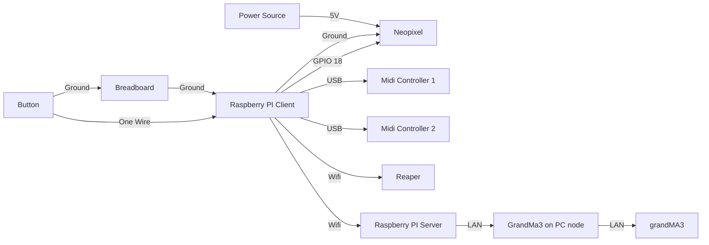

# Project L.U.M.E.N - Prism Cipher
## Introduction
Project L.U.M.E.N takes place in Sector 536 - A cosmic frontier within NYP , named after the classroom where it all began. This project is inspired by Singapore's growing investment in space research and technology. Sector 536 invites guests to explore a series of immersive space stationed at the edge of the unknown, these are the 4 exhibits :

Station 1 - Laser Defence Protocol
Station 2 - Kinetic Core Recharge
Station 3 - Chromatic Defence Simulator
Station 4 - Launch Core Override

  <h2 align = "center">
  Presented by:<br>
  <a href="https://github.com/syakiltrm"></a>
  <a href="https://github.com/Kean-en"></a>
  <a href="https://github.com/ArifYazid05"></a>
  <a href="https://github.com/Wayne-Teo"></a>
</h2>


## Dependencies
### Hardware:
1. Raspberry Pi 4
2. Neopixel WS2812B
3. 5V DC Supply
4. Midi Controller
5. Push Button
6. GrandMA3
7. Yamaha QL1

### Software
1. RealVNC 
2. Visual Studio Code
3. Raspbian OS
4. Reaper
5. L-ISA
### Python Packages:
1. GPIO 
2. rpi_ws281x
3. mido
4. osc
5. rtmidi
## System Diagram



# MVP Code Logic

## run.py

```python
import RPi.GPIO as GPIO
import time
import board
import neopixel
from pythonosc.udp_client import SimpleUDPClient

import Level_cycle
import lvl_1
import lvl_2
import lvl_3

# --- NeoPixel Config ---
LED_COUNT = 120
LED_PIN = board.D18
strip = neopixel.NeoPixel(LED_PIN, LED_COUNT, brightness=0.5, auto_write=False)

# --- GPIO Setup ---
BUTTON_PIN = 23
GPIO.setmode(GPIO.BCM)
GPIO.setup(BUTTON_PIN, GPIO.IN, pull_up_down=GPIO.PUD_UP)

# --- OSC Clients ---
REAPER_CLIENT = SimpleUDPClient("192.168.254.12", 8000)
LIGHT_CLIENT = SimpleUDPClient("192.168.254.213", 2000)


```
- Imports all necessary modules for GPIO, NeoPixel, OSC, and custom level scripts.
- Configures a NeoPixel LED strip with 120 LEDs connected to GPIO 18.
- Sets up GPIO 23 as the input pin for a physical button with a pull-up resistor.
- Establishes two OSC clients:
  - One for REAPER (audio cue controller).
  - One for GrandMA3 (lighting controller).

  ### `Button Hold` Function

```python
def wait_for_button_hold(threshold=2):
    print("[INFO] Waiting for button hold to start...")
    held_time = 0
    while True:
        if GPIO.input(BUTTON_PIN) == GPIO.LOW:
            start_time = time.time()
            while GPIO.input(BUTTON_PIN) == GPIO.LOW:
                held_time = time.time() - start_time
                progress = int((held_time / threshold) * LED_COUNT)
                for i in range(LED_COUNT):
                  strip[i] = (255, 255, 255) if i < progress else(0, 0, 0)
                strip.show()
                if held_time >= threshold:
                    print("[INFO] Button held long enough to start!")
                    REAPER_CLIENT.send_message("/marker/25", 1.0)
                    REAPER_CLIENT.send_message("/action", 1007)
                    strip.fill((0, 0, 0))
                    strip.show()
                    return
                time.sleep(0.01)
        time.sleep(0.01)

```

- This function waits for the player to press and hold the physical button connected to GPIO 23.
- As the player holds the button, the NeoPixel strip progressively lights up white to show progress.
- If held for the defined `threshold` (default 2 seconds), it:
  - Sends marker `/marker/25` and `/action/1007` to REAPER via OSC to begin the game.
  - Turns off the LED strip and returns to continue execution.

### `main()` Function

```python
def main():
    try:
        wait_for_button_hold(threshold=2)
        level = Level_cycle.select_level()
        if level == 1:
            lvl_1.run_level_1(REAPER_CLIENT, LIGHT_CLIENT, strip)
        elif level == 2:
            lvl_2.run_level_2(REAPER_CLIENT, LIGHT_CLIENT, strip)
        elif level == 3:
            lvl_3.run_level_3(REAPER_CLIENT, LIGHT_CLIENT, strip)
    except KeyboardInterrupt:
        print("[EXIT] Cleaning up GPIO")
        GPIO.cleanup()
```
- This is the main control function that coordinates the game setup and flow.
- It starts by calling `wait_for_button_hold()` to make sure the player wants to begin.
- Then it runs the level selection process using `Level_cycle.select_level()`.
- Based on the selected level, it calls the corresponding level function:
  - Level 1 → `run_level_1()`
  - Level 2 → `run_level_2()`
  - Level 3 → `run_level_3()`
- If the player presses Ctrl+C (keyboard interrupt), it cleans up the GPIO resources gracefully.


## Level_cycle.py

### `clear_board` Function
```python
def clear_board(outport):
    for row in launchpad_grid:
        for note in row:
            outport.send(mido.Message('note_on', note=note, velocity=0))
```
- Clears all pads on the Launchpad by sending a note_on message with velocity 0, turning off the lights

### `fill_board` Function
```python
def fill_board(outport, color):
    vel = COLOR_MAP[color]
    for row in launchpad_grid:
        for note in row:
            outport.send(mido.Message('note_on', note=note, velocity=vel))
```
- Fills the entire Launchpad grid with a specific color by translating the color into a MIDI velocity and sending it to every pad.

### `show_level` Function
```python
def show_level(outport, level):
    clear_board(outport)
    color = COLOR_MAP['green']
    for y in range(level):
        for x in range(8):
            outport.send(mido.Message('note_on', note=launchpad_grid[y][x], velocity=color))
```
- Visually shows the current level on the Launchpad by lighting up a number of rows in green equal to the level number.

### `fill_pixels` Function
```python
def fill_pixels(strip, color, ratio):
    count = int(ratio * strip.n)
    for i in range(strip.n):
        strip[i] = color if i < count else (0, 0, 0)
    strip.show()
```
- Used during button holding to progressively light up the NeoPixel strip based on how long the button is being held, giving visual feedback.

### `wait_for_start_button` Function
```python
def wait_for_start_button(reaper_client):
    print("[WAIT] Holding button for 2s to start...")
    hold_time = 2
    start_time = None
    filling = False

    while True:
        if GPIO.input(BUTTON_PIN) == GPIO.LOW:
            if start_time is None:
                start_time = time.time()
            held = time.time() - start_time

            if not filling:
                print("[FILL] Button held, filling NeoPixel white")
                filling = True

            fill_pixels(strip, (255, 255, 255), held / hold_time)
        else:
            if start_time:
                if time.time() - start_time >= hold_time:
                    print("[OSC] REAPER: /marker 25")
                    reaper_client.send_message("/marker", 25)
                    reaper_client.send_message("/action", 1007)
                    strip.fill((0, 0, 0))
                    strip.show()
                    return
            start_time = None
            filling = False
            strip.fill((0, 0, 0))
            strip.show()
        time.sleep(0.01)
```
- Waits for the player to press and hold the physical GPIO button. If the button is held for 2 seconds, it sends OSC messages to REAPER to trigger the game start. While holding, the NeoPixel strip progressively lights up in white as feedback.

### `select_level` Function
```python
def select_level(reaper_client):
    level = 1
    print("[OSC] REAPER: /marker 26")
    reaper_client.send_message("/marker", 26)
    reaper_client.send_message("/action", 1007)

    show_level(outport1, level)
    show_level(outport2, level)

    while True:
        msg1 = inport1.receive(block=False)
        msg2 = inport2.receive(block=False)
        msg = msg1 or msg2
        if msg and msg.type == 'note_on' and msg.velocity > 0:
            note = msg.note

            if note == launchpad_grid[7][7]:  # bottom-right confirm
                print(f"[LEVEL] Confirmed Level {level} → /marker 28")
                reaper_client.send_message("/marker", 28)
                reaper_client.send_message("/action", 1007)
                clear_board(outport1)
                clear_board(outport2)
                return level

            if note == launchpad_grid[0][0]:  # top-left cycle
                level = (level % 3) + 1
                print(f"[LEVEL] Switched to Level {level}")
                show_level(outport1, level)
                show_level(outport2, level)
        time.sleep(0.01)
```
- Handles the level selection process using the Launchpad:
- Top-left pad cycles through levels 1 to 3.
- Bottom-right pad confirms selection.
- Sends OSC messages /marker 26 and /marker 28 to REAPER when selection begins and is confirmed.
- Shows the current level visually by lighting rows on both Launchpads.

## lvl_1.py

### `clear_pixels` Function
```python
def clear_pixels(strip):
    for i in range(strip.numPixels()):
        strip.setPixelColor(i, Color(0, 0, 0))
    strip.show()
```
- Turns off all LEDs on the NeoPixel strip by setting each pixel to black and calling .show() to apply the change.
 
### `clear_board` Function
```python
def clear_board(outport):
    for row in launchpad_grid:
        for n in row:
            outport.send(mido.Message('note_on', note=n, velocity=0))
```
- def clear_board(outport):
    for row in launchpad_grid:
        for n in row:
            outport.send(mido.Message('note_on', note=n, velocity=0))

### `show_sequence_on_strip` Function
```python
def show_sequence_on_strip(strip, sequence):
    num_colors = len(sequence)
    pixels_per_color = strip.numPixels() // num_colors
    index = 0
    for color in sequence:
        c = NEO_COLORS[color]
        for _ in range(pixels_per_color):
            if index < strip.numPixels():
                strip.setPixelColor(index, c)
                index += 1
    while index < strip.numPixels():
        strip.setPixelColor(index, Color(0, 0, 0))
        index += 1
    strip.show()
```
- Generates a random color sequence with no immediate duplicates. Ensures every color step is unique from the one before it.

### `get_2x2_block(x,y)` Function
```python
def get_2x2_block(x, y):
    return [launchpad_grid[y + dy][x + dx] for dy in range(2) for dx in range(2)]
```
- Returns the MIDI note numbers for a 2×2 Launchpad block starting at position (x, y).

### `light_block` Function
```python
def light_block(outport, block, color):
    vel = COLOR_MAP[color]
    for n in block:
        outport.send(mido.Message('note_on', note=n, velocity=vel))
```
- Lights up a given 2×2 Launchpad block with a specified color by translating it into MIDI velocity.
### `flush_midi_input(inport)` Function
```python
def flush_midi_input(inport):
    while inport.poll():
        pass
```
- Clears any residual MIDI messages from the input buffer to prevent old button presses from affecting the game.

### `setup_blocks` Function
```python
def setup_blocks():
    all_positions = [(x, y) for x in range(0, 7, 2) for y in range(0, 7, 2)]
    random.shuffle(all_positions)
    return [get_2x2_block(x, y) for x, y in all_positions]
```
- Generates 2×2 Launchpad blocks at valid positions (non-overlapping), shuffles their order for randomness.

### `draw_blocks(player,sequence)` Function
```python

def draw_blocks(player, sequence):
    player['note_map'].clear()
    for i in range(player['index'], len(sequence)):
        blk = player['blocks'][i]
        color = sequence[i]
        light_block(player['outport'], blk, color)
        for n in blk:
            player['note_map'][n] = (blk, color)
```
- Lights up all the blocks for the player's current sequence and stores mapping of each pad to its expected color.

### `restart_sequence(player,sequence)` Function
```python
def restart_sequence(player, sequence):
    player['index'] = 0
    clear_board(player['outport'])
    draw_blocks(player, sequence)
```
- Resets a player's progress by clearing the Launchpad and redrawing the full sequence.

### `flash_winner` Function
```python
def flash_winner(winner):
    for _ in range(3):
        for row in launchpad_grid:
            for n in row:
                outport1.send(mido.Message('note_on', note=n, velocity=COLOR_MAP['green' if winner == 1 else 'red']))
                outport2.send(mido.Message('note_on', note=n, velocity=COLOR_MAP['green' if winner == 2 else 'red']))
        time.sleep(0.2)
        clear_board(outport1)
        clear_board(outport2)
        time.sleep(0.1)
```
-  Win sequence by flashing 3 times on either green (player 1) or red (player 2) on all Launchpads.

### `run_level_1` Function Overall
```python
def run_level_1(reaper_client, light_client, strip):
```
- The core function for Level 1 gameplay.

#### Inside this function:

- Sends OSC markers to REAPER and GrandMA3 to start the game lighting and sound.
- Creates a unique 4-color sequence.
- Shows it on the NeoPixel strip.
- Players must press the matching Launchpad blocks in the correct order.
- If wrong: flashes red, restarts sequence, sends /marker/30.
- If correct: progresses. First to finish all 4 wins.
- Sends OSC /marker/27 or /marker/29 to REAPER depending on winner and /action/1007 to trigger playback.

## lvl_2.py

### Similar to lvl_1.py functions except:
```python
 seq_len = 8
        sequence = get_unique_sequence(seq_len)
        show_sequence_on_strip(strip, sequence)
        clear_board(outport1)
        clear_board(outport2)
```
- Board shows 8 colours in level 2 instead of 4 colours in level 1

### `run_level_2` Function Overall
```python
def run_level_2(reaper_client, light_client, strip):
```
- The core function for Level 2 gameplay.

#### Inside this function:

- Sends OSC markers to REAPER and GrandMA3 to start the game lighting and sound.
- Creates a unique 8-color sequence.
- Shows it on the NeoPixel strip.
- Players must press the matching Launchpad blocks in the correct order.
- If wrong: flashes red, restarts sequence, sends /marker/30.
- If correct: progresses. First to finish all 8 wins.
- Sends OSC /marker/27 or /marker/29 to REAPER depending on winner and /action/1007 to trigger playback.

## lvl_3.py

### Similar to lvl_1.py and lvl_2.py functions except:
```python
 seq_len = 12
        sequence = get_unique_sequence(seq_len)
        show_sequence_on_strip(strip, sequence)
        clear_board(outport1)
        clear_board(outport2)
```
- Board shows 12 colours in level 2 instead of 4 or 8 colours in level 1 and 2

### `run_level_3` Function Overall
```python
def run_level_3(reaper_client, light_client, strip):
```
- The core function for Level 3 gameplay.

#### Inside this function:

- Sends OSC markers to REAPER and GrandMA3 to start the game lighting and sound.
- Creates a unique 12-color sequence.
- Shows it on the NeoPixel strip.
- Players must press the matching Launchpad blocks in the correct order.
- If wrong: flashes red, restarts sequence, sends /marker/30.
- If correct: progresses. First to finish all 12 wins.
- Sends OSC /marker/27 or /marker/29 to REAPER depending on winner and /action/1007 to trigger playback.

## Level_cycle.py

This script manages level selection using a **physical push button** (GPIO 17) and the **Launchpad Pro MK3**.

---

###  Purpose
- Allows players to **cycle through Level 1, 2, or 3**
- Uses visual feedback on the Launchpad to indicate the current level
- Waits for the player to **confirm** their selection by pressing a **green 2×2 confirmation block**
---
### `MIDI` & `GPIO` Setup Functions
```python
import RPi.GPIO as GPIO
import time
import mido

BUTTON_PIN = 17

MIDI_PORT = "Launchpad Pro MK3:Launchpad Pro MK3 LPProMK3 MIDI 20:0"
inport = mido.open_input(MIDI_PORT)
outport = mido.open_output(MIDI_PORT)

launchpad_grid = [[(r + 1) * 10 + (c + 1) for c in range(8)] for r in range(8)]
```
- Configures GPIO pin 17 for button input
- Sets up MIDI input/output for the Launchpad
- Defines an 8x8 grid of note numbers for pad layout

### `Noted` Functions

```python
def get_2x2_block(x, y):
    return [launchpad_grid[y + dy][x + dx] for dy in range(2) for dx in range(2)]

def light_block(block, velocity):
    for n in block:
        outport.send(mido.Message('note_on', note=n, velocity=velocity))

def clear_board():
    for row in launchpad_grid:
        for note in row:
            outport.send(mido.Message('note_on', note=note, velocity=0))
```
- Returns a square block of 4 Launchpad notes.
- Lights up a block with a specified velocity (color).
- Turns off all Launchpad pads.

### Level `Shape Mapping` Functions

```python
level_shapes = [
    [(0,0),(2,2),(4,4),(6,6)],
    [(0,6),(2,4),(4,2),(6,0)],
    [(3,1),(3,3),(3,5),(3,7)]
]
```
- Predefined block coordinates for each level

- Visually differentiates each level using blue blocks in different shapes

### `Main` Level Selection logic
```python
def select_level():
    GPIO.setmode(GPIO.BCM)
    GPIO.setup(BUTTON_PIN, GPIO.IN, pull_up_down=GPIO.PUD_UP)

    import run
    run.LIGHT_CLIENT.send_message("/gma3/cmd", "Go+ Sequence 52")

    level = 0
    confirm_block = get_2x2_block(6, 6)
    light_block(confirm_block, 21)  # green confirm block

    while True:
        shape = level_shapes[level]
        clear_board()
        light_block(confirm_block, 21)
        for x, y in shape:
            light_block(get_2x2_block(x, y), 78)  # blue pads

        if GPIO.input(BUTTON_PIN) == GPIO.LOW:
            run.REAPER_CLIENT.send_message("/marker/26", 1.0)
            run.REAPER_CLIENT.send_message("/action", 1007)
            time.sleep(0.25)
            level = (level + 1) % 3

        msg = inport.receive(block=False)
        if msg and msg.type == 'note_on' and msg.velocity > 0:
            if msg.note in confirm_block:
                clear_board()
                return level + 1

        time.sleep(0.01)
```
- Initializes button and OSC trigger for lighting cue
- Cycles through level shapes on button press
- Waits for user to confirm selection using a green 2x2 pad
- Returns the selected level as an integer (1, 2, or 3)

## Summary of Controls

| Action                    | Result                                        |
|---------------------------|-----------------------------------------------|
| Press physical button     | Cycle through Level 1 → 2 → 3                 |
| Watch Launchpad visual    | Blue pads change to show different shapes     |
| Press top-right green pad | Confirm selected level                        |
| Launchpad clears          | Game begins with selected difficulty level    |


